# 萤火集桌面端

萤火集桌面端是面向个人学习记录、复盘和规划的本地优先应用。项目以学习过程数据为核心，将每日记录、阶段目标、分类体系、统计分析、倒计时、专注计时和成就事件集中在一个桌面工作区中。

桌面端强调单用户、本地存储和低干扰操作。应用默认使用本机 SQLite 数据库保存学习记录，界面围绕重复使用场景组织，避免登录、社区排行和远程服务依赖。

## 仓库关系

- 原始 Web 仓库：[`learning-analytics-system`](https://github.com/galaxywk223/learning-analytics-system)
- 当前桌面仓库：[`yinghuoji-desktop`](https://github.com/galaxywk223/yinghuoji-desktop)

桌面仓库以 Web 版本的产品方法为参考，但保持独立演进：

- 运行时代码独立。
- Git 仓库独立。
- 数据存储方式独立。
- 发布流程独立。

## 产品定位

萤火集桌面端服务于长期学习中的四类问题：

- 学习过程需要持续记录，而不是只保存最终成果。
- 学习方向需要通过阶段和分类持续校准。
- 学习复盘需要数据图表和原始记录同时存在。
- 学习动力需要倒计时、成就节点和格言内容形成提醒。

桌面端当前聚焦本地学习工作流，不包含 Web 版本的注册登录、JWT、社区排行等在线协作能力。

## 功能模块

| 模块 | 说明 |
| --- | --- |
| 仪表盘 | 汇总今日学习时长、累计记录、近期目标、里程碑和最近记录。 |
| 专注模式 | 使用计时器记录单次专注过程，并在开始前绑定阶段、分类和子分类。 |
| 学习记录 | 管理历史学习记录，支持按阶段、分类、日期和内容追踪学习过程。 |
| 统计分析 | 通过趋势、分类、阶段和效率数据观察学习投入结构。 |
| 倒计时 | 管理考试、报名、项目节点等关键日期。 |
| 成就时刻 | 记录重要成果、节点和附件，形成长期成长档案。 |
| 阶段管理 | 管理当前学习阶段和目标周期。 |
| 分类管理 | 管理主分类和子分类，统一记录和统计口径。 |
| 格言管理 | 管理仪表盘和学习过程中的提醒文案。 |
| 数据管理 | 支持本地数据导出、导入和清空。 |
| 关于与更新 | 展示应用版本、更新检查和发布信息。 |

## 界面预览

截图由 `npm run docs:screenshots` 生成，来源为本机桌面端真实数据。截图尺寸为 1440 × 920，路径位于 `docs/screenshots/`。

### 仪表盘

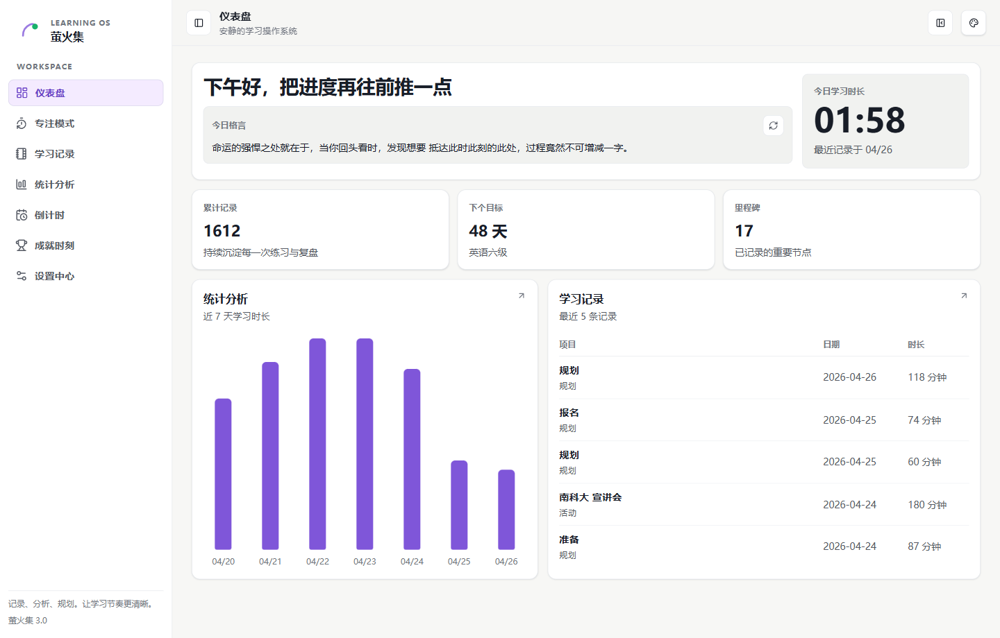

### 专注模式

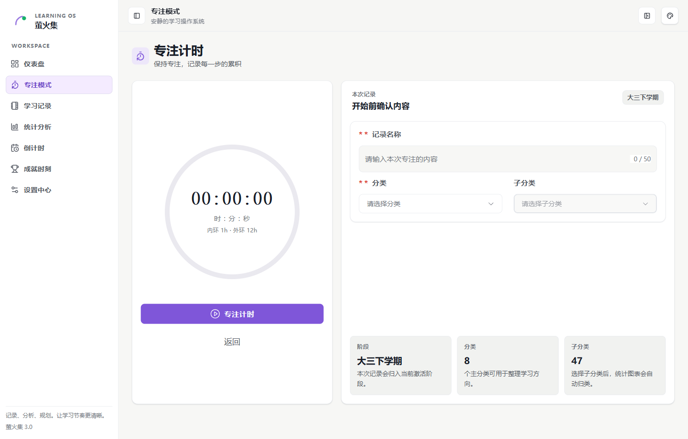

### 学习记录

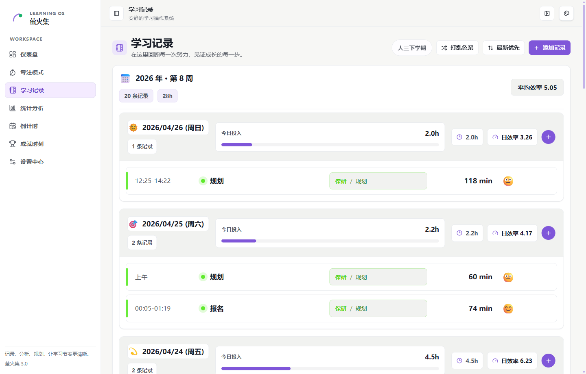

### 统计分析

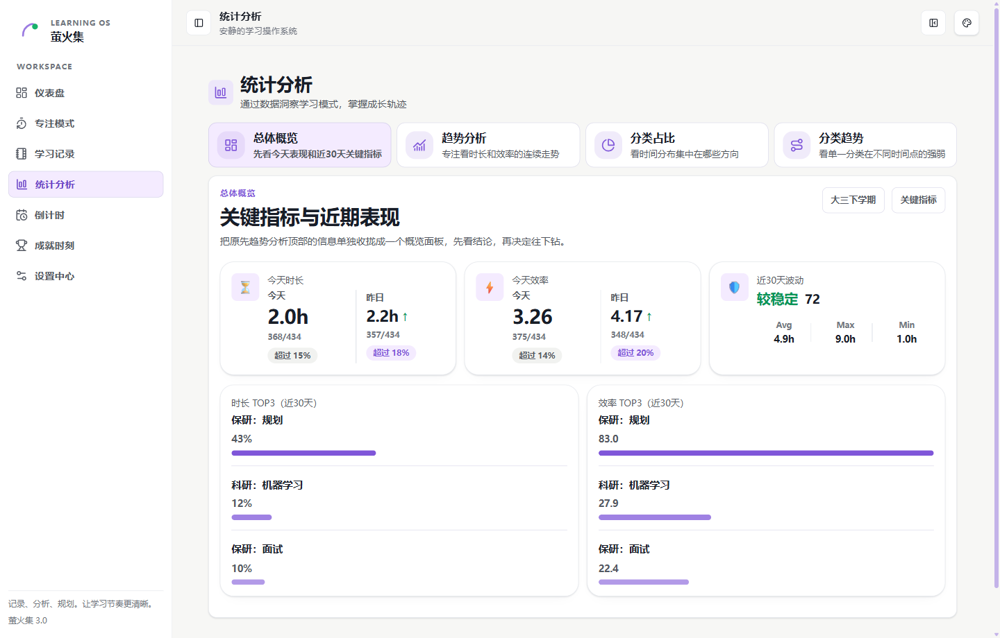

### 倒计时

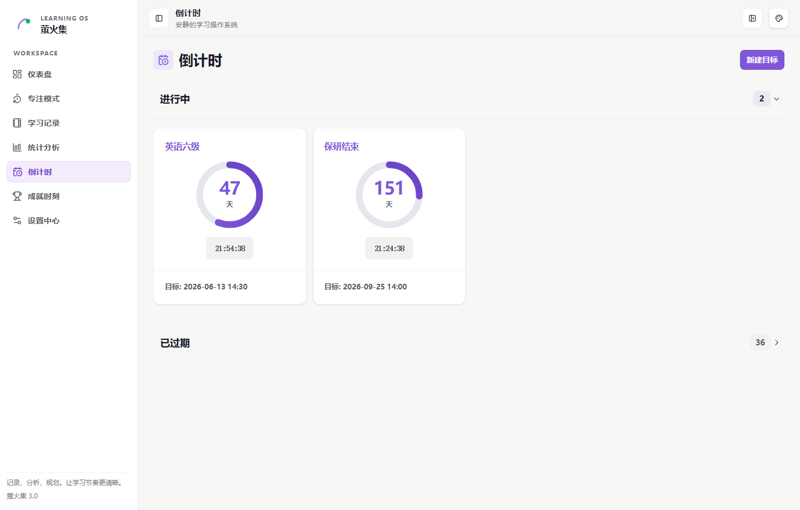

### 成就时刻

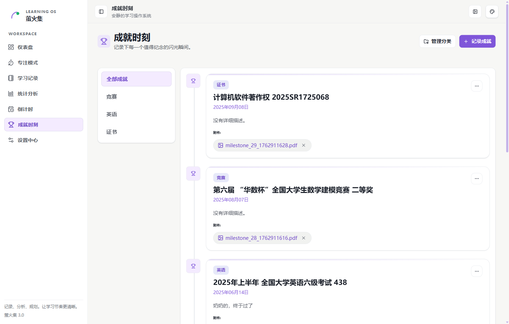

### 成就分类管理

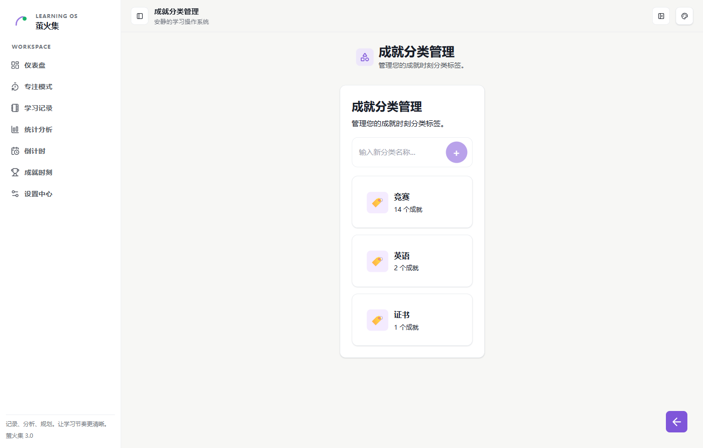

### 阶段管理

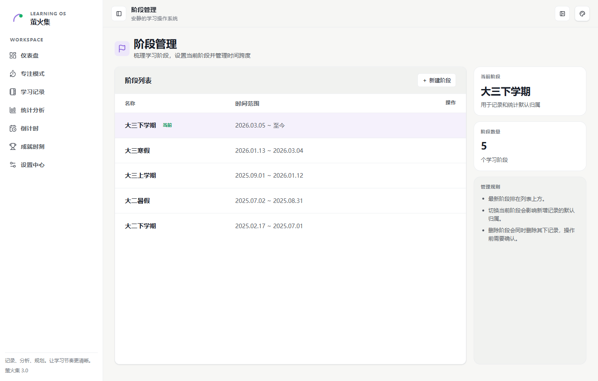

### 分类管理

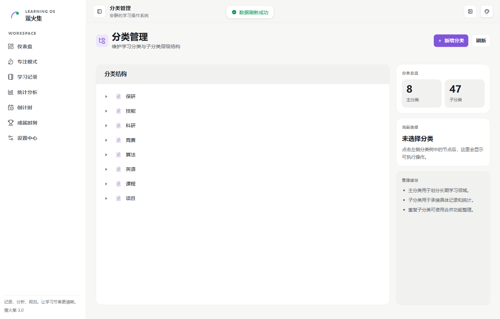

### 数据管理

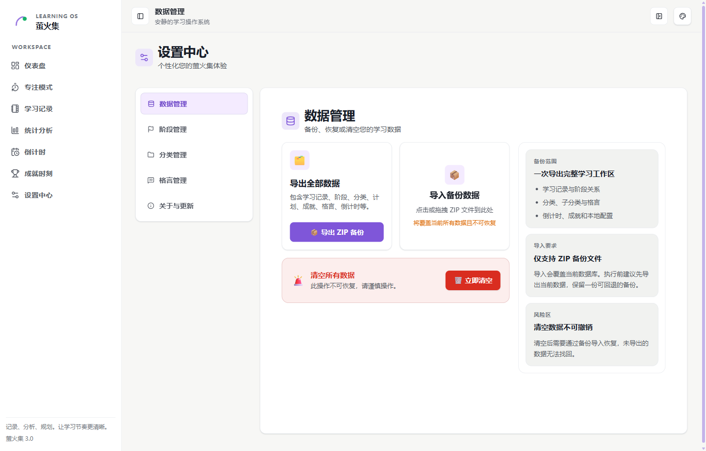

### 设置内阶段管理

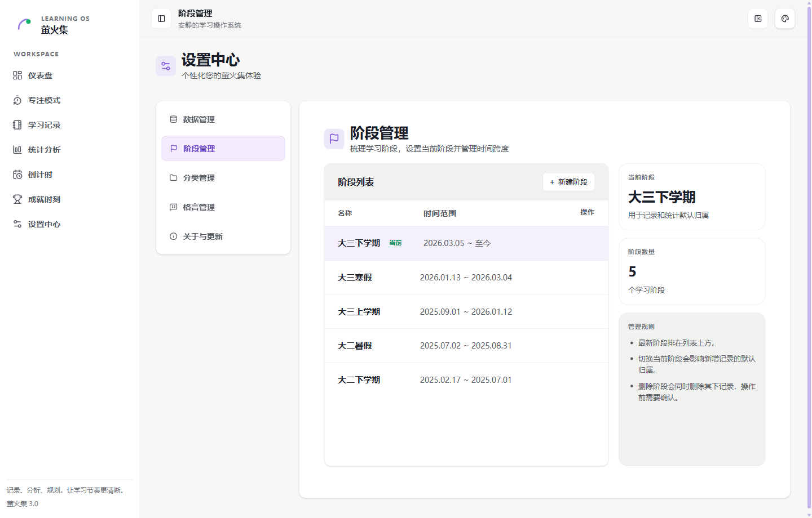

### 设置内分类管理

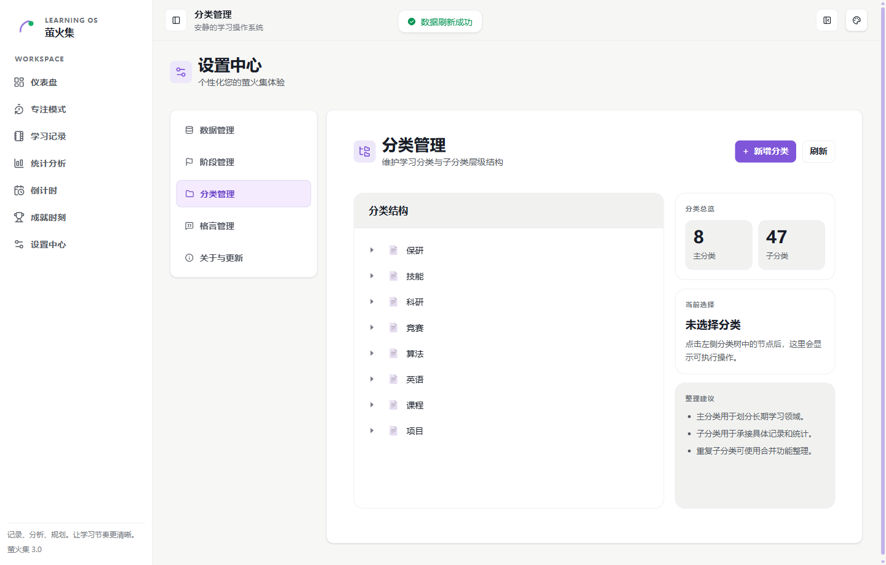

### 格言管理

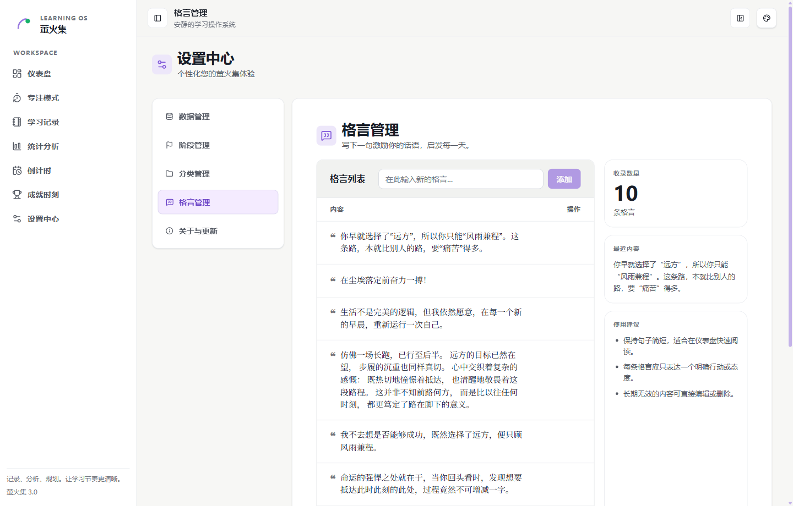

### 关于与更新

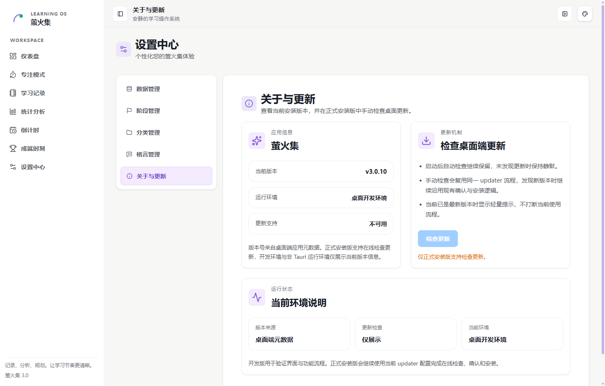

## 技术栈

- Vue 3
- TypeScript
- Pinia
- Element Plus
- ECharts
- Tauri 2
- Rust
- SQLite

## 本地数据

桌面端采用本地优先的数据模型：

- 学习记录、阶段、分类、倒计时、格言和成就数据保存在本机。
- 数据导出使用 ZIP 备份文件。
- 数据导入会覆盖当前数据库，执行前需要保留可回退备份。
- 清空数据不可撤销，恢复依赖导出的备份文件。

## 开发命令

安装依赖：

```bash
npm install
```

启动桌面端开发环境：

```bash
npm run desktop:dev
```

运行类型检查：

```bash
npm run type-check
```

构建桌面端安装包：

```bash
npm run desktop:build
```

## 截图生成

截图脚本用于更新 README 中的桌面端界面预览：

```bash
npm run docs:screenshots
```

脚本行为如下：

- 启动真实 Tauri 桌面端开发环境。
- 通过 WebView2 远程调试端口连接桌面 WebView。
- 使用本机现有应用数据逐页访问路由。
- 临时切换为浅色主题和展开侧栏。
- 保存完整桌面视口截图到 `docs/screenshots/`。
- 截图完成后恢复原有主题和侧栏偏好。

截图生成前需要关闭已经运行的萤火集窗口，避免 WebView2 进程占用调试端口或锁定开发版可执行文件。

## 发布说明

桌面端发布使用 Tauri 的 Windows NSIS 打包目标。更新配置位于 `src-tauri/tauri.conf.json`，发布产物由 GitHub Releases 承载。

常规发布流程包含以下环节：

- 更新应用版本号。
- 执行类型检查和构建。
- 生成 Tauri 安装包和更新元数据。
- 创建 Git tag。
- 推送到远程仓库并发布 Release。

## 开源协议

桌面端仓库沿用 Web 仓库协议，使用 [GNU Affero General Public License v3.0 only](./LICENSE) 发布。
